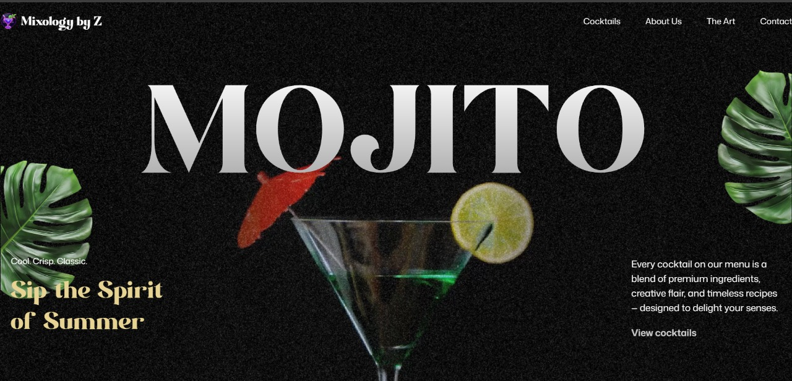

# 🍸 Cocktail Landing Page

The Cocktail GSAP Landing Page is a modern, fully responsive, and performance-optimized web experience built using React.js, Vite, and GSAP (GreenSock Animation Platform). It showcases a fictional high-end cocktail brand through fluid animations, parallax visuals, and scroll-triggered interactions.

This project demonstrates proficiency in frontend UI/UX engineering, animation logic, responsive design, and video integration — ideal for brand storytelling or product showcases.




---

## 🚀 Features

- 🎨 Sleek UI and color-themed design
- 💫 Smooth scroll and entry animations (GSAP)
- 📱 Fully responsive (mobile-first)
- 🎥 Scroll-controlled background video
- ✨ Split text reveal animations
- ⚡️ Fast Vite build and performance-optimized

---

## 🛠️ Tech Stack

- **React.js** (via Vite)
- **GSAP** (with ScrollTrigger and SplitText)
- **Tailwind CSS** (custom CSS)
- **FFmpeg** (for optimizing video)
- **Responsive Hooks** (via `react-responsive`)

---

## 📸 Live Demo

👉 [View Live Site](https://mixologybyz.vercel.app/)

---

## 📦 Installation & Setup

1. **Clone the repo**
   ```bash
   git clone https://github.com/yourusername/cocktail-gsap.git
   cd cocktail-gsap
2. **Install dependencies**

   ```bash
   npm install
   ```
3. **Start development server**

   ```bash
   npm run dev
   Visit http://localhost:5173
   ```

4. **Optimizing Your Video (Optional but Recommended)**
   **Use FFmpeg:**
   ```bash
   ffmpeg -i input.mp4 -vf scale=960:-1 -movflags faststart -vcodec libx264 -crf 20 -g 1 -pix_fmt yuv420p output.mp4
   ```
